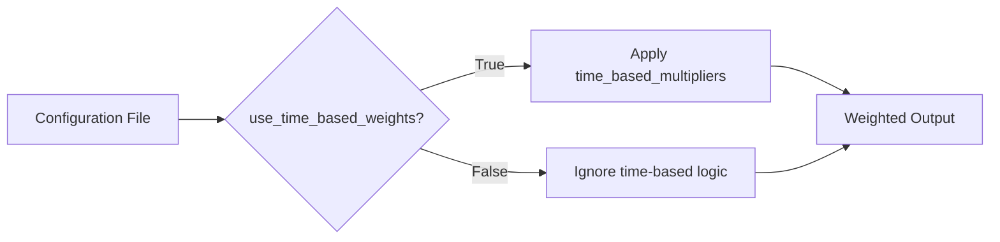

# Version History
# Changelog

## Version History

This document tracks significant updates, improvements, and bug fixes in the repository. Below is a chronological list of changes.

---

### **Latest Updates (Unreleased)**

#### New Features & Configuration Options
- **Time-Based Weighting Control**  
  Added two new configuration parameters to manage time-based weighting behavior:
  - `use_time_based_weights` (default: `False`):  
    Set to `False` to disable time-based weighting entirely. Overrides `time_based_multipliers`.
  - `time_based_multipliers` (default: `{}`):  
    Define custom multipliers for time-based adjustments (e.g., `{"recent": 1.5, "old": 0.8}`).

#### Improvements
- **Error Handling**  
  Enhanced error messages and validation for configuration files to simplify debugging.
- **UTF-8 Encoding Enforcement**  
  All agent configuration files must now be saved with UTF-8 encoding to avoid parsing issues.

#### Documentation
- **README Updates**  
  - Added details about Together AI integration (PR #112 by **Bluu**).
  - Grammar and clarity improvements across documentation (PR #106 by **ef95023**).

---

### **Key Notes**
- **Backward Compatibility**  
  No breaking changes introduced. Existing configurations will continue to work as expected.
- **Best Practices**  
  - Disable `use_time_based_weights` if time-based adjustments are not needed.
  - Validate configuration files using UTF-8 encoding before deployment.

---

*Diagram: Time-based weighting decision flow.*

---

For older versions, refer to the [Git commit history](https://github.com/your-repo-link/commits/main).
