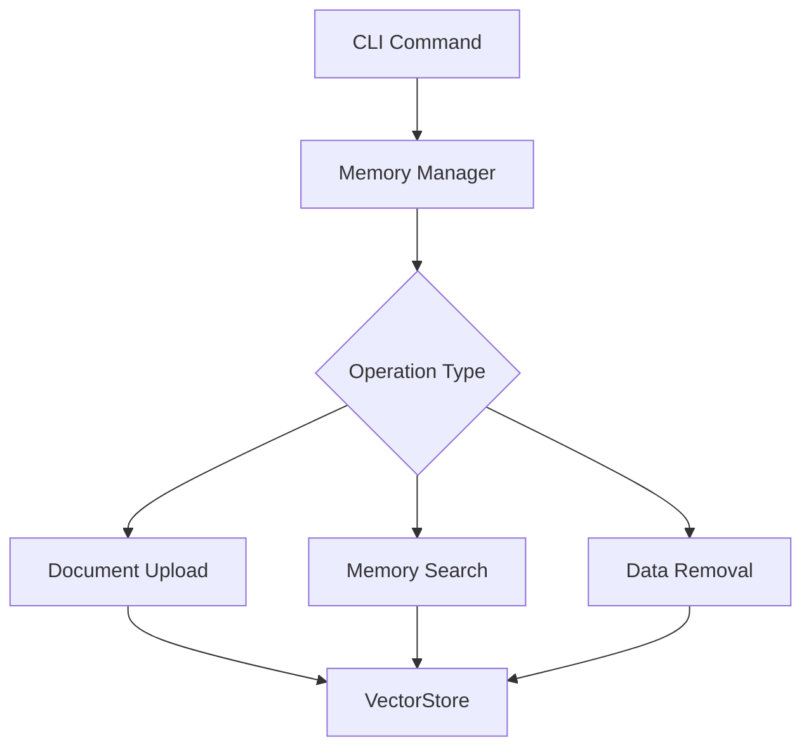
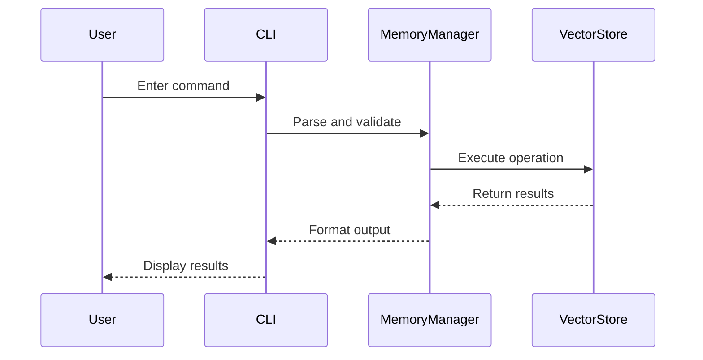

# CLI Commands
# Core Components

## CLI Commands

The CLI commands provide direct access to manage agent memories through the command-line interface. These commands enable document ingestion, memory inspection, and data maintenance operations.

### Command Overview



### Memory Management Commands

#### 1. `upload-document`
**Description:** Ingest files into agent memory with automatic chunking  
**Usage:**
```bash
upload-document <file_path> [--category <name>]
```
**Parameters:**
- `file_path`: PDF, Markdown, or text file to process
- `--category`: Optional organizational tag

**Examples:**
```bash
upload-document research.pdf --category astronomy
upload-document meeting_notes.md
```

#### 2. `search-memories` 
**Description:** Find relevant information using semantic search  
**Aliases:** `find`, `search`
```bash
search-memories "quantum physics basics" --limit 5
```

#### 3. `list-memories`
**Description:** Browse stored memory metadata  
**Aliases:** `ls-mem`, `memlist`
```bash
list-memories --category project_alpha
```

#### 4. `wipe-memory`
**Description:** Remove stored memories  
**Aliases:** `rm-mem`, `memwipe`
```bash
wipe-memory --all  # Remove everything
wipe-memory --category temporary_data
```

### Command Handling Flow


> [!NOTE]
> All memory operations are agent-specific. Use `load-agent` before managing memories.

### Best Practices
1. Categorize documents during upload for better organization
2. Use semantic search before creating new agents
3. Regularly prune unused categories with `wipe-memory`
4. Combine with `list-agents` for cross-agent memory management

```bash
# Example workflow
list-agents
load-agent research_bot
upload-document paper.pdf --category quantum_mechanics
search-memories "entanglement principles"
```
