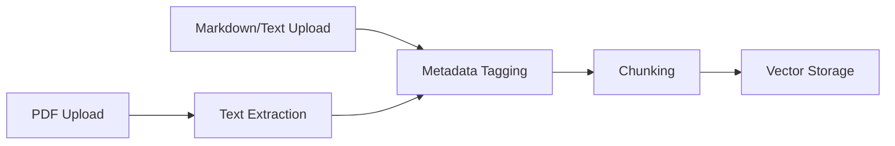

# MemoryManager
# Core Components: MemoryManager

The `MemoryManager` is the central component responsible for managing document-based memory in agents. It handles the full lifecycle of document processing from ingestion to retrieval, enabling agents to maintain persistent, organized knowledge bases.

## Key Responsibilities

### 1. Document Ingestion Pipeline
- Accepts multiple file formats:
  - PDF (with text extraction)
  - Markdown
  - Plain text
- Performs automatic metadata tagging:
  - Source document identification
  - Timestamp recording
  - Agent-specific namespace isolation



### 2. Chunking Strategy
Implements basic text segmentation:
```python
def chunk_document(text: str, chunk_size: int = 512) -> list[str]:
    return [text[i:i+chunk_size] for i in range(0, len(text), chunk_size)]
```
> [!NOTE]
> Current chunking uses fixed-size windows. Future versions will implement semantic-aware segmentation.

### 3. Memory Retrieval System
Integrates with VectorStore for semantic search:
```python
class MemoryManager:
    def __init__(self, vector_store: VectorStore):
        self.store = vector_store
        
    def search_memory(self, query: str, top_k: int = 5) -> list[MemoryItem]:
        return self.store.semantic_search(query, top_k)
```

## CLI Integration
Basic usage example:
```bash
# Upload document to agent's memory
agent memory upload --agent-id=123 --file=manual.pdf

# Search across stored memories
agent memory search "installation instructions"
```

## Best Practices
1. **Namespace Management**
   - Use distinct namespaces per agent
   - Add custom metadata tags for complex deployments

2. **Performance Considerations**
   - Pre-process large documents before ingestion
   - Monitor chunk sizes for optimal search relevance

3. **Integration Patterns**
   ```python
   # Initialize with ChromaDB backend
   vector_store = VectorStore(adapter=ChromaAdapter())
   memory_manager = MemoryManager(vector_store)
   
   # Typical workflow
   memory_manager.ingest_document("technical_guide.md")
   results = memory_manager.search_memory("error code 404")
   ```

See [VectorStore documentation](#core-components-vectorstore) for storage implementation details.
