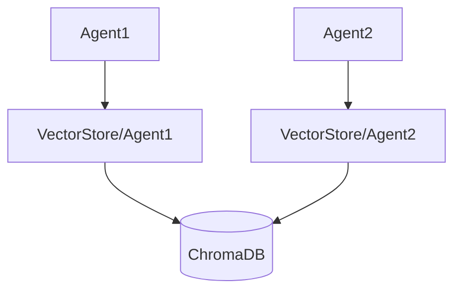

# VectorStore
# Core Components: VectorStore

## Overview
The `VectorStore` component is the backbone of the document memory system, responsible for storing and retrieving document embeddings using vector similarity search. It enables efficient semantic search across stored memories by leveraging ChromaDB's vector database capabilities.

## Key Responsibilities

### 1. Vector Storage Management
- Stores document embeddings in a structured format
- Maintains metadata including:
  - Agent identifiers
  - Document categories
  - Original source references
  - Chunk relationships

### 2. Semantic Search Engine
```python
# Example search implementation
from chromadb.api import ClientAPI

class VectorStore:
    def semantic_search(self, query: str, agent_id: str, top_k: int=5):
        collection = self.client.get_collection(agent_id)
        results = collection.query(
            query_texts=[query],
            n_results=top_k
        )
        return results
```

### 3. ChromaDB Integration


## Key Features

### Category-Based Organization
- Supports multiple document categories through namespaces
- Enables filtered searches by category tags

### Agent-Specific Isolation


### Search Operations
| Operation | Parameters | Returns |
|-----------|------------|---------|
| `search` | query, agent_id, category | Top-K relevant chunks |
| `batch_search` | multiple queries | Aggregated results |
| `metadata_search` | filters | Filtered documents |

> [!NOTE]
> Similarity scores may appear lower with small datasets due to sparse embedding space. Relative ranking remains reliable regardless of absolute score values.

## Usage Example
```python
# Initialize VectorStore with ChromaDB backend
vector_store = VectorStore(
    embedding_model="text-embedding-3-small",
    persist_dir="./chroma_data"
)

# Store document embeddings
vector_store.store_memories(
    agent_id="research_bot",
    documents=processed_chunks,
    metadata={"category": "scientific_papers"}
)

# Perform semantic search
results = vector_store.semantic_search(
    query="neural network architectures",
    agent_id="research_bot",
    top_k=3
)
```

## Best Practices
1. **Index Maintenance**
- Regularly compact indexes for optimal performance
- Monitor embedding dimensions consistency

2. **Search Optimization**
- Use category filters to narrow search scope
- Adjust `top_k` based on use case requirements

3. **Data Persistence**
- Configure proper storage paths for ChromaDB
- Implement backup strategies for vector stores

See [Memory Manager Documentation](#core-components-memorymanager) for integration details with other system components.
