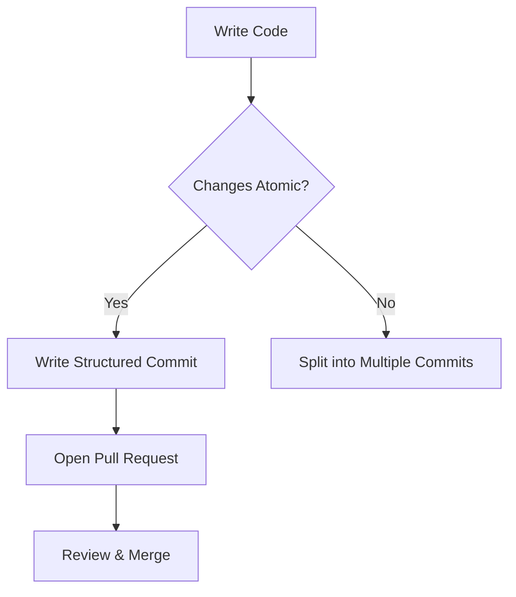

# Commit Guidelines
# Development

## Commit Guidelines

This section outlines the standards for creating meaningful commit messages and maintaining a clean version history in the repository. Adhering to these guidelines ensures readability, traceability, and efficient collaboration.

---

### Commit Message Structure
Follow this format for commit messages:

```plaintext
<type>(<scope>): <subject>
<BLANK LINE>
<body>
<BLANK LINE>
<footer>
```

#### Components:
1. **Type**: Use one of the following prefixes:
   - `feat`: New feature
   - `fix`: Bug fix
   - `docs`: Documentation updates (e.g., README, `.env.example`)
   - `chore`: Maintenance tasks (e.g., dependency updates)
   - `refactor`: Code restructuring without functional changes
   - `test`: Test-related changes

2. **Scope**: Optional context (e.g., `scanner`, `agent-config`, `evm`).

3. **Subject**: A concise 50-character summary in imperative mood (e.g., "Add" instead of "Added").

4. **Body**: Detailed explanation of changes (if needed).

5. **Footer**: Reference related issues or PRs (e.g., `Closes #112`).

---

### Examples
**Good**:
```plaintext
docs(readme): Add Together AI integration details
- Updated API configuration section
- Added authentication workflow example
Closes #112
```

**Avoid**:
```plaintext
fixed some stuff in readme and configs
```

---

### Workflow Diagram


---

### Best Practices
1. **Atomic Commits**: 
   - Group related changes (e.g., `evm functionality + agent-configs` is acceptable if tightly coupled).
   - Separate unrelated changes (e.g., `fixed scanner links` should be its own commit).

2. **Cross-Referencing**:
   - Link PRs using GitHub syntax: `Merge pull request #106 from donatik27/main`.

> [!NOTE]
> For multi-component updates like `readme + env example`, use the `docs` type with a `(general)` scope.

---

### Summary
- Use imperative mood in subjects (`Add` not `Added`)
- Limit line lengths to 72 characters in bodies
- Reference all related issues/PRs in footers
- Validate messages using repository linters (if configured)

Adopting these standards ensures the commit history serves as a reliable historical record for all contributors.
