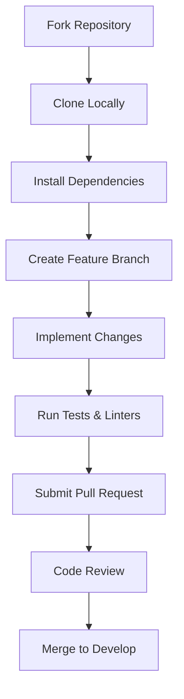

# Contributing
# Development

## Contributing

This section outlines guidelines and procedures for contributing to the repository. Follow these steps to ensure smooth collaboration and maintain code quality.

---

### Introduction
Contributions are welcome! To maintain a cohesive development environment, adhere to the practices below. This includes setting up the project locally, following coding standards, and submitting pull requests (PRs).

---

### Development Setup

1. **Clone the Repository**  
   Fork and clone the repository locally:
   ```bash
   git clone https://github.com/threewebcode/<repository-name>.git
   cd <repository-name>
   ```

2. **Install Dependencies**  
   Install development dependencies using the `dev`, `lint`, and `test` extras:
   ```bash
   pip install -e ".[dev,lint,test]"
   ```

3. **Pre-Commit Hooks**  
   Enable automated code formatting and linting:
   ```bash
   pre-commit install
   ```

---

### Code Guidelines

- **Linting**: Use `flake8`, `black`, and `mypy` to enforce style and type checks:
  ```bash
  flake8 src/
  black --check src/
  mypy src/
  ```
- **Formatting**: Automatically format code with:
  ```bash
  black src/
  ```
- **Documentation**: Follow [Google-style docstrings](https://google.github.io/styleguide/pyguide.html) for API clarity.

> [!NOTE]  
> The `lint` extra includes `black`, `flake8`, `isort`, and `mypy` for streamlined quality checks.

---

### Testing

1. **Run Unit Tests**  
   Execute tests with `pytest` and parallelize using `pytest-xdist`:
   ```bash
   pytest -n auto tests/
   ```
2. **Hypothesis for Property-Based Testing**  
   Validate edge cases with dynamically generated inputs:
   ```bash
   hypothesis run tests/
   ```

---

### Submitting a Pull Request

1. **Branch Naming**  
   Use prefixes like `feat/`, `fix/`, or `docs/` (e.g., `feat/add-login-endpoint`).

2. **Commit Messages**  
   Follow [Conventional Commits](https://www.conventionalcommits.org/):
   ```
   feat: add authentication middleware
   fix: resolve null pointer in user API
   ```

3. **PR Checklist**  
   - Ensure tests pass.
   - Update documentation if needed.
   - Link to related issues.

---

### Contribution Workflow Diagram



---

### Best Practices

- **Document Changes**: Update the `README` or relevant docs for new features.
- **Keep PRs Focused**: Address one issue per pull request.
- **Communicate Early**: Discuss major changes via issues before coding.

---

### Summary
By following these guidelines, you ensure consistency and efficiency in the development process. For questions, open an issue or reach out to the maintainers.
