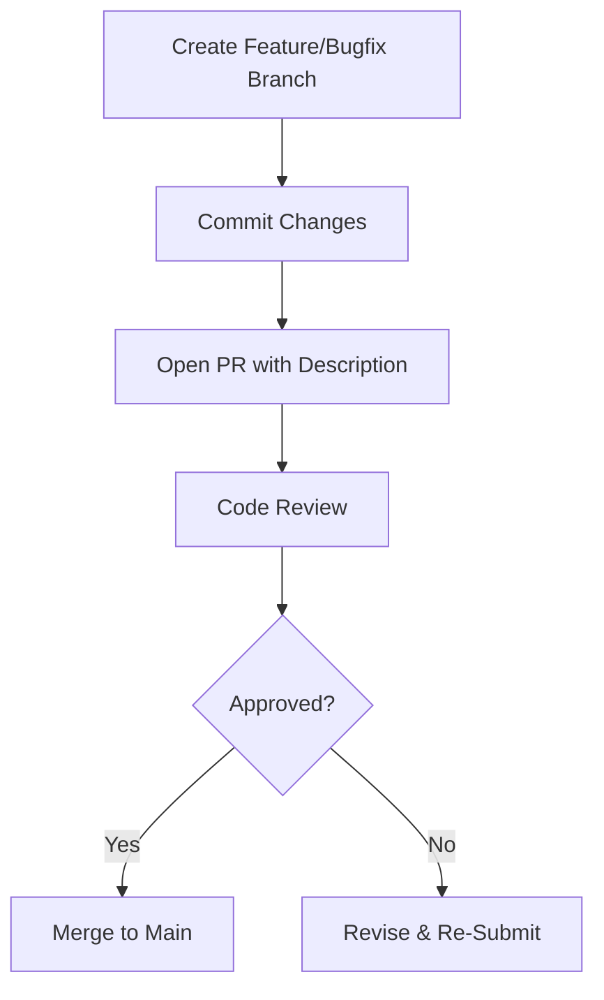

# Pull Requests
```markdown
# Development

## Pull Requests

This section outlines the process, guidelines, and examples for contributing via pull requests (PRs) to the repository. PRs are the primary mechanism for submitting code changes, improvements, or new features.

---

### PR Workflow

The repository follows this PR lifecycle:


---

### Key PR Examples

#### 1. **DeBridge Integration (PR #131)**
**Objective**: Add DeBridge support to ZerePy while maintaining backward compatibility.

**Technical Changes**:
- Added `DeBridgeConnection` class with API endpoint handlers
- Implemented transaction helper for Solana order submission:
  ```python
  class TransactionHelper:
      @staticmethod
      def create_solana_order(params):
          # Recreates DeBridge's order submission workflow
          return serialized_transaction
  ```
- Enhanced EVM error handling in `evm_connector.py`

**Testing Protocol**:
- Manual testing on Ethereum, Sonic, and Base via Anvil Fork
- Cross-chain transaction validation

---

#### 2. Documentation Updates (PRs #106, #112)
- Grammar/clarity improvements in code comments
- Added AI integration documentation to README:
  ```markdown
  ## AI Features
  The system leverages Together AI for:
  - Natural language processing
  - Context-aware query resolution
  ```

---

### PR Requirements
1. **Branch Naming**: Use `feature/<name>` or `fix/<issue>`
2. **Description Template**:
   ```markdown
   ### Objective
   [What this changes]
   
   ### Technical Approach
   [Architecture/design decisions]
   
   ### Tests Performed
   [Manual/automated validation]
   ```
3. **Validation**:
   - Include test results (screenshots or console output)
   - For smart contract changes:
     ```bash
     forge test --match-contract DeBridgeTest
     ```

> [!NOTE]
> Always rebase with `develop` branch before submission to resolve merge conflicts early.

---

### Best Practices
- **Atomic Commits**: One logical change per commit
- **Issue Linking**: Reference GitHub issues using `#123`
- **Peer Review**: Require 2 approvals for merges to `main`

```
