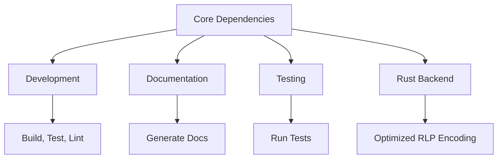

# Dependencies
```markdown
# Getting Started

## Dependencies

This section outlines the core and optional dependencies required to set up, develop, and test the repository. Proper dependency management ensures compatibility and reproducibility across environments.

---

### Core Dependencies

The repository relies on the following mandatory packages:

| Package             | Version Constraint              | Purpose                                      |
|---------------------|---------------------------------|----------------------------------------------|
| `eth-typing`        | `>=3.0.0`                       | Type definitions for Ethereum applications.  |
| `eth-utils`         | `>=2.0.0`                       | Utility functions for Ethereum codebases.    |
| `parsimonious`      | `>=0.9.0,<0.10.0`              | Parsing grammars and structured text.        |
| `hexbytes`          | `>=0.1.0,<1`                   | Byte manipulation with hex representations. |
| `rlp`               | `>=0.6.0`                      | Recursive Length Prefix (RLP) encoding.      |
| `typing-extensions` | `>=4.0.1` (Python <=3.11 only) | Backport of Python typing features.          |

> [!NOTE]
> `typing-extensions` is automatically included only for Python versions `<=3.11`.

---

### Optional Extras

Optional dependencies are grouped into "extras" for specific use cases. Install them using:  
`pip install .[extra1,extra2]`

#### 1. **Development (`dev`)**
Required for contributing to the repository:
```text
build (>=0.9.0)
bumpversion (>=0.5.3)
eth-hash[pycryptodome]
hypothesis (>=4.18.2,<5.0.0)
ipython
pre-commit (>=3.4.0)
pytest (>=7.0.0)
pytest-pythonpath (>=0.7.1)
pytest-timeout (>=2.0.0)
pytest-xdist (>=2.4.0)
sphinx (>=6.0.0)
sphinx-rtd-theme (>=1.0.0)
towncrier (>=21,<22)
tox (>=4.0.0)
twine
wheel
```

#### 2. **Documentation (`docs`)**
Build and maintain documentation:
```text
sphinx (>=6.0.0)
sphinx-rtd-theme (>=1.0.0)
towncrier (>=21,<22)
```

#### 3. **Testing (`test`)**
Run unit and integration tests:
```text
eth-hash[pycryptodome]
hypothesis (>=4.18.2,<5.0.0)
pytest (>=7.0.0)
pytest-pythonpath (>=0.7.1)
pytest-timeout (>=2.0.0)
pytest-xdist (>=2.4.0)
```

#### 4. **Rust Backend (`rust-backend`)**
Enable Rust-accelerated components:
```text
rusty-rlp (>=0.2.1)
```

---

### Dependency Workflow



---

### Best Practices

1. **Virtual Environments**: Use tools like `venv` or `conda` to isolate dependencies.
2. **Version Pinning**: For production deployments, pin exact versions in `requirements.txt`.
3. **Extras**: Minimize extras in production to reduce dependency bloat.
4. **Pre-commit Hooks**: Enable `pre-commit install` for automated code checks.

```bash
# Example: Install core + dev dependencies
pip install -e .[dev]
```
