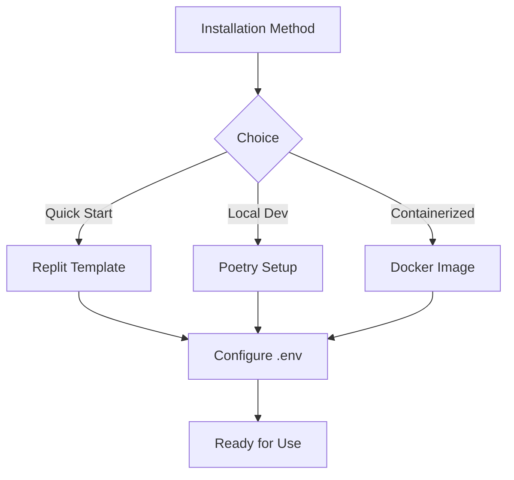

# Installation
```markdown
# Getting Started

## Installation

This section guides you through setting up ZerePy in your development environment. Choose from multiple installation methods based on your workflow preferences.

### Prerequisites

- **Python 3.10+**: Verify with `python --version`
- **Poetry 1.5+**: Install via [official instructions](https://python-poetry.org/docs/)
- **Environment Variables**: See [Configuration](#) for required keys (covered in next section)

---

### Installation Methods

#### 1. Replit Template (Quickest)
```bash
1. Open template: https://replit.com/@blormdev/ZerePy?v=1
2. Click "Fork" (requires Replit account)
3. Click "Run" to initialize environment
```
> [!NOTE]
> This template includes pre-configured dependencies but still requires [API keys](#configuration).

#### 2. Local Installation with Poetry
```bash
# Clone repository
git clone https://github.com/yourorg/zerepy.git
cd zerepy

# Install dependencies
poetry install

# Activate virtual environment
poetry shell
```

#### 3. Docker Installation
```bash
# Pull latest image
docker pull zerepy/core:latest

# Run container with environment mounting
docker run -it --env-file .env zerepy/core
```

---

### Dependency Management
ZerePy uses Poetry for deterministic dependency resolution. Key package groups:

```toml
[tool.poetry.group.llm.dependencies]
openai = "^1.3.0"
anthropic = "^0.12.0"

[tool.poetry.group.onchain.dependencies]
web3 = "^6.0.0"
solana = "^0.25.0"
```

Install specific groups with:
```bash
poetry install --with llm,onchain
```

---

### Environment Setup Flow


---

## Post-Installation
1. Proceed to [Configuration](#) for API key setup
2. Validate installation with:
```bash
zerepy --version
```
3. Explore available commands:
```bash
zerepy --help
```

> [!IMPORTANT]
> Always verify package integrity with `poetry check` before first run in local installations.
```
