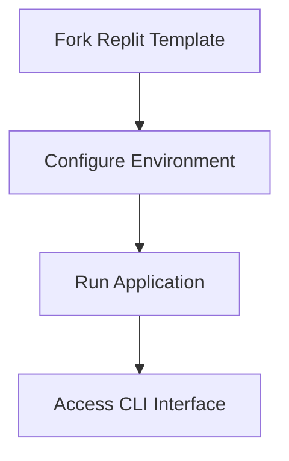

# Quick Start Guide
```markdown
# Getting Started

## Quick Start Guide

This guide will help you quickly set up and run ZerePy using our pre-configured Replit template. Follow these steps to get started in under 5 minutes.

### 1. Using Replit Template
The fastest way to start interacting with ZerePy:



1. **Fork the template**:  
   Visit [ZerePy Replit Template](https://replit.com/@blormdev/ZerePy?v=1) and:
   - Click "Fork" (requires Replit account)
   - Wait for environment initialization

2. **First Run**:  
   Click the ▶️ Run button to:
   - Install dependencies via Poetry
   - Set up base configuration
   - Start the CLI interface

3. **Initial Verification**:
   After successful run, you should see:
   ```bash
   ZerePy CLI v1.0 ready
   Type 'help' for command list
   ```

> [!NOTE]
> The template comes with test credentials - replace these with your own keys before production use.

### 2. Local Development Setup
For advanced users wanting local installation:

**Prerequisites**:
- Python 3.10+ (`python --version`)
- Poetry 1.5+ (`poetry --version`)

```bash
# Clone repository
git clone https://github.com/yourorg/zerepy.git
cd zerepy

# Install dependencies
poetry install

# Activate virtual environment
poetry shell
```

### 3. Configuration
Configure your environment variables in `.env`:

```ini
# LLM Providers (choose at least one)
OPENAI_API_KEY=sk-your-key-here
ANTHROPIC_API_KEY=claude-key-here

# Social Integrations (optional)
X_API_KEY=your_twitter_key
FARCASTER_RECOVERY_PHRASE="12-word phrase"

# Chain Credentials (secure these!)
SOLANA_PRIVATE_KEY=your_sol_key
ETHEREUM_PRIVATE_KEY=your_eth_key
```

### 4. Next Steps
After initial setup:
1. Run basic diagnostics: `zerepy check-system`
2. Configure your first agent: `zerepy agent create`
3. Explore integrations: `zerepy integrations list`

**Best Practices**:
- Store private keys in password managers
- Use separate API keys per environment
- Regularly update dependencies with `poetry update`

```

> This documentation combines template usage instructions with essential configuration details while maintaining security awareness. The Mermaid diagram provides visual guidance for the setup flow, and code blocks show exact implementation steps.
