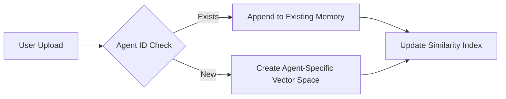
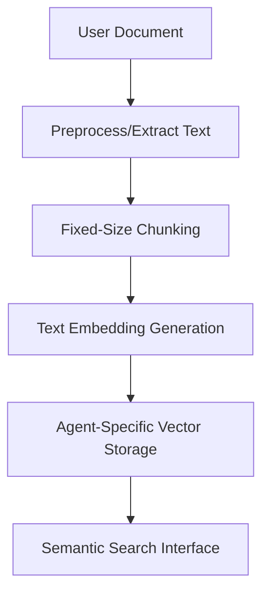

# Design Decisions
# Implementation Notes: Design Decisions

## Overview  
This section explains the key design choices behind the memory system implementation, focusing on scalability, performance, and usability within the current architecture.

---

## Core Design Principles

1. **Modular Component Design**  
   - Separated responsibilities between `MemoryManager` (coordination) and `VectorStore` (storage/search) to enable future backend swaps
   - Example component interaction:
     ```python
     # Simplified workflow
     memory_manager = MemoryManager()
     vector_store = VectorStore(provider=ChromaDB())
     
     # Document processing flow
     chunks = memory_manager.chunk_document(uploaded_file)
     vector_store.ingest(chunks, agent_id=current_agent)
     ```

2. **CLI-First Implementation**  
   - Limited initial scope to CLI for:
     - Faster iteration cycles
     - Simplified debugging
     - Clear user feedback loop during development

---

## Architectural Choices

### ChromaDB Selection  
| Factor | Decision Rationale |
|--------|--------------------|
| Embedding Flexibility | Supports multiple embedding models |
| Local Persistence | Eliminates external dependencies for testing |
| Performance | Optimized for small-to-medium dataset speeds |

### Memory Isolation  


**Key Benefits:**  
- Prevents cross-agent contamination
- Enables targeted memory wipes
- Reduces search scope during operations

---

## Implementation Tradeoffs

1. **Chunking Simplicity**  
   Used basic fixed-size text splitting despite limitations because:
   - Provided immediate functional baseline
   - Avoided over-engineering before real-world testing
   - Maintained predictable performance characteristics

2. **Similarity Scoring Approach**  
   ```python
   # Pseudo-code of relative ranking implementation
   def find_relevant_memories(query):
       raw_scores = vector_store.similarity_search(query)
       normalized = (raw_scores - min_score) / (max_score - min_score)
       return sorted(zip(normalized, chunks), reverse=True)
   ```
   - Prioritized consistent ranking over absolute scores
   - Added score normalization for human interpretation

---

## Summary & Best Practices

**When Extending This System:**
1. Maintain agent memory isolation when adding new storage backends
2. Preserve the `ingest → chunk → store` pipeline structure
3. Validate against both small and growing dataset scenarios

> [!NOTE]
> For detailed architectural context, see [Architecture Overview](#architecture-overview). Current limitations are documented in [System Limitations](#limitationsfuture-work).



*Diagram 1: Document processing workflow showing key decision points in the memory pipeline*
