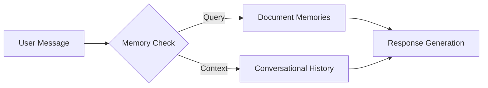
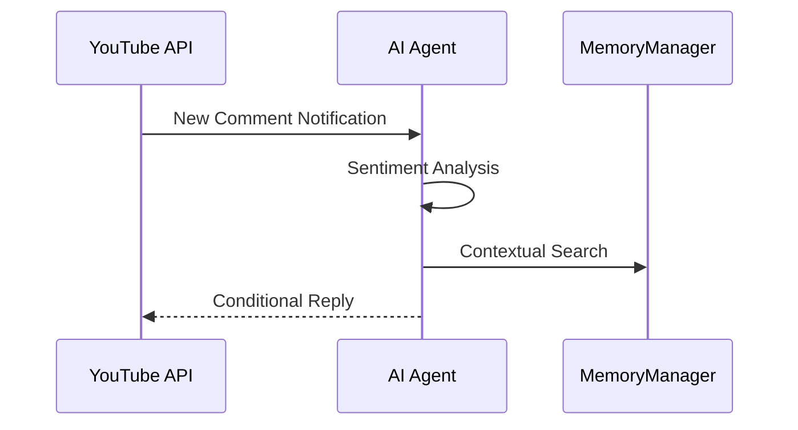

# Future Enhancements
# Implementation Notes

## Future Enhancements

This section outlines planned improvements and extensions to the repository's memory management system. These enhancements aim to expand functionality, improve performance, and address current limitations.

---

### 1. Conversational Memory Integration
**Current State**: Only document-based memory is supported.  
**Planned Enhancement**:  
Add support for retaining and referencing dialogue history between users and agents. This will enable context-aware conversations across multiple interactions.



> [!NOTE]  
> Conversational memory will be stored separately from document memories to maintain distinct retrieval pipelines.

---

### 2. Advanced Chunking Strategies
**Current Limitation**: Basic fixed-size text splitting.  
**Proposed Improvements**:
- Semantic chunking using sentence boundaries
- Content-aware segmentation for technical documents
- Dynamic chunk size adjustment based on document type

Example proposed chunking function:
```python
def dynamic_chunker(text: str, min_size=200, max_size=1000) -> List[str]:
    """Split text while preserving complete sentences"""
    sentences = nltk.sent_tokenize(text)
    chunks = []
    current_chunk = []
    # [...] (chunk assembly logic)
    return chunks
```

---

### 3. Enhanced Embedding Models
**Current Behavior**:  
Similarity scores show lower absolute values with small datasets but maintain correct relative rankings.  

**Planned Improvements**:
- Experiment with dense retrieval models (e.g., Sentence-BERT)
- Implement hybrid sparse-dense embeddings
- Add dimensionality reduction for legacy documents

---

### 4. Video Interaction Capabilities
**New Feature Roadmap**:


Key considerations:
- Rate limiting (max 3 replies/hour/channel)
- Spam detection using regex patterns
- Context-aware response generation

---

### 5. Sentiment Analysis Engine
**Planned Implementation**:
```python
class CommentAnalyzer:
    def should_respond(self, comment: str) -> bool:
        sentiment = self._get_sentiment(comment)
        urgency = self._detect_keywords(comment)
        return sentiment in ["POSITIVE", "NEUTRAL"] and urgency > 0.5
```

---

## Summary of Priorities
1. Implement conversational memory storage (Q3 2024)
2. Upgrade chunking system (Q4 2024)
3. Add YouTube integration (Q1 2025)

**Best Practices for Contributors**:
- When working on embeddings, maintain backward compatibility with existing vector stores
- Use feature flags for experimental memory implementations
- Follow the [memory format specification](../specs/memory-format-v2.md) for new features
