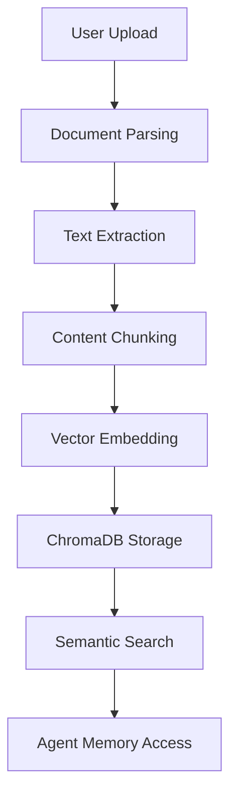

# Overview
```markdown
# Introduction

## Overview

The Memory Management System enables AI agents to persistently store and retrieve information from documents through structured memory operations. This system forms the foundation for context-aware interactions in CLI-based chat environments.

### Core Architecture

Key components powering the memory system:
- **MemoryManager**: Orchestrates document processing pipeline
  - Ingestion: Supports PDF/text/markdown formats
  - Chunking: Automatic content segmentation
  - Retrieval: Context-aware memory access
- **VectorStore**: Implements ChromaDB-based semantic search
  - Dense vector embeddings
  - Similarity-based ranking
  - Category-driven organization



### Key Capabilities

**Document Processing**
- PDF text extraction via PyPDF2
- Markdown/text file support
- Automatic chunking strategies

**Memory Organization**
- Agent-specific isolation
- Category-based semantic indexing
- Persistent storage

**CLI Management**
```bash
# Example memory operations
agent memory upload research.pdf --category=technical
agent memory search "neural networks" --limit=5
agent memory wipe --category=obsolete
```

> [!NOTE]
> Current implementation is CLI-focused for testing. Web interface integration is planned for future releases.

### System Characteristics

| Aspect              | Implementation Detail              |
|---------------------|------------------------------------|
| Storage Backend     | ChromaDB with cosine similarity    |
| Text Processing     | SpaCy-based chunking               |
| Document Support    | PDF/Markdown/Plaintext             |
| Search Precision    | Context-aware semantic matching    |

**Best Practices**
1. Use descriptive categories for memory organization
2. Monitor chunk sizes (optimal range: 256-512 tokens)
3. Regular memory audits through CLI search/list
4. Wipe obsolete memories to maintain relevance
```
