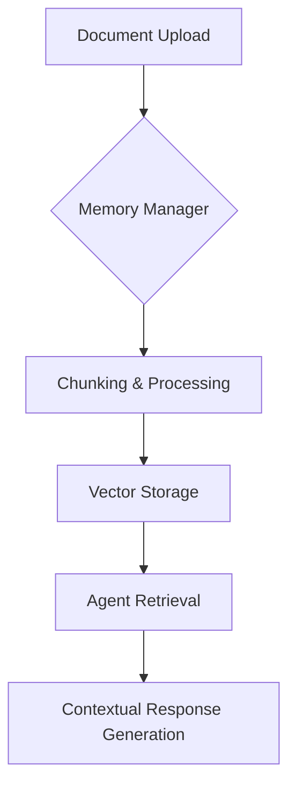

# Purpose
```markdown
# Introduction

## Purpose

The Memory Management System is designed to enhance agent capabilities by enabling persistent, context-aware interactions through document-based knowledge retention. This system addresses the challenge of maintaining continuity in conversational AI agents by providing structured access to historical document context while avoiding repetitive or generic responses.

### Key Objectives
1. **Context Preservation**: Store and retrieve document knowledge across sessions
2. **Semantic Understanding**: Enable context-aware responses using vector embeddings
3. **Operational Efficiency**: Provide CLI tools for memory management and testing



### Core Functionality
- **Document Processing Pipeline**:
  - Automatic chunking of uploaded documents (PDF/Text/Markdown)
  - Vector embedding generation using ChromaDB
  - Category-based organization for efficient retrieval

- **Memory Operations**:
  - `upload`: Ingest documents with metadata tagging
  - `search`: Perform semantic similarity queries
  - `list`: Browse memory contents hierarchically
  - `wipe`: Remove outdated or irrelevant memories

> [!NOTE]
> The current implementation focuses on CLI-based interaction for rapid iteration and testing. Future versions will expand to API and UI integrations.

### Best Practices
1. **Memory Organization**:
   - Use clear category tags during upload
   - Maintain document chunk sizes between 200-500 tokens
   - Regularly prune outdated content with `wipe` command

2. **Retrieval Optimization**:
   - Combine semantic search with metadata filtering
   - Implement cache layers for frequent queries
   - Monitor search relevance metrics

This system establishes foundation for long-term conversational context while maintaining performance through efficient memory management patterns. Developers should focus on optimizing chunking strategies and retrieval parameters for specific use cases.
```
