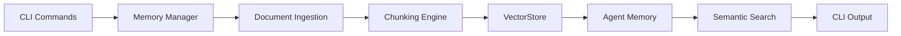

# Scope
```markdown
## Scope

The document memory system enables agents to persistently store, organize, and retrieve information from uploaded documents. This section outlines the boundaries of the current implementation, including supported features, integration points, and limitations.

### Key Aspects
- **CLI-Centric Implementation**: Initial deployment is limited to CLI-based interactions for testing memory management workflows. Commands include document upload, search, listing, and removal.
- **Document Support**: Processes PDF files (via text extraction) and plain text/markdown documents. Automatic chunking splits content into retrievable segments.
- **Agent-Specific Memory**: Each agent maintains an isolated memory space, configurable via [agent configurations](./agent-configurations.md).
- **Semantic Search**: Leverages ChromaDB for vector storage and similarity-based retrieval, organized by user-defined categories.
- **Memory Operations**: Supports basic CRUD operations through CLI commands, with persistent storage for cross-session availability.

### Limitations
- No GUI/web interface (CLI-only in current release).
- Document size limits and chunking strategies are fixed (non-customizable).
- Limited to text-based formats; binary files (e.g., images) are unsupported.

> [!NOTE]
> Future updates may expand support to API endpoints, custom chunking rules, and additional file formats.

### Integration Diagram


**Summary**: This system provides foundational document retention capabilities for agents, with an emphasis on CLI-driven testing and semantic retrieval. Best practices include categorizing documents during upload and using precise search queries.
