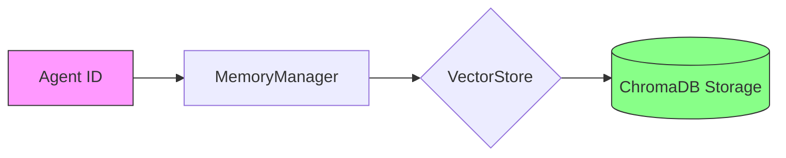

# Agent-specific Persistent Memory
```markdown
# Key Features

## Agent-specific Persistent Memory

The Agent-specific Persistent Memory system enables individual AI agents to maintain isolated, long-term document-based memory stores. This architecture ensures each agent operates with its own knowledge base while providing durable storage across sessions.

### Technical Implementation

Key characteristics:
- **Isolated Memory Stores**: Each agent's memories are stored separately using unique namespace identifiers
- **Persistent Storage**: Memory contents survive application restarts via ChromaDB vector storage
- **Document-Centric**: Focuses on file-based knowledge retention rather than conversation history



### Core Operations

1. **Memory Initialization**:
```python
# Create memory instance for agent "research_bot"
memory = MemoryManager(agent_id="research_bot")
```

2. **Document Operations**:
```bash
# CLI command to upload to specific agent
agent memory:upload research_bot --file paper.pdf --category scientific
```

3. **Cross-Agent Isolation**:
- Agent "finance_bot" cannot access memories of "research_bot"
- Separate vector embeddings per agent namespace

### Best Practices
1. Use clear agent naming conventions
2. Assign documents to semantic categories during upload
3. Regularly prune outdated memories using CLI wipe commands

> [!NOTE]
> The persistent memory system is currently CLI-only. Web/API interfaces are planned for future releases. Contributions welcome!
```

This documentation section links to [Core Components](#core-components) and [CLI commands](#cli-commands-for-memory-management) while maintaining agent-specific focus. The mermaid diagram visualizes the persistence layer relationship, and code examples show practical usage patterns.
