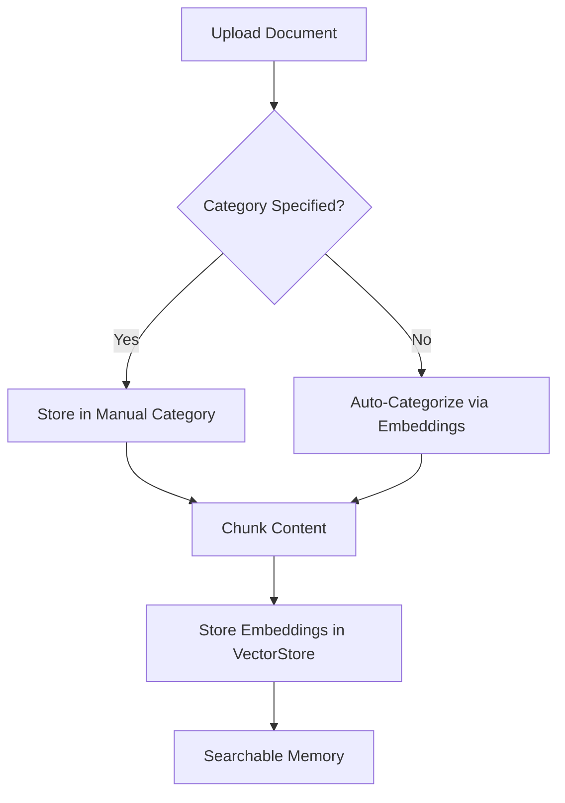

# Category-based Organization
```markdown
# Key Features

## Category-based Organization

The category-based memory organization system enables structured storage and retrieval of document memories using semantic groupings. This approach enhances search efficiency and maintains contextual relationships between stored documents.

### Implementation Overview
- **Semantic Categorization**: Documents are automatically grouped by content similarity using embedding vectors
- **Custom Categories**: Users can manually assign categories during document upload via CLI
- **Hierarchical Storage**: Memories are organized as `Category > Document > Chunk` in the vector store



### Core Functionality
1. **Category Assignment**:
```bash
# CLI example: Upload document with manual category assignment
agent memory upload --category technical-specs /path/to/document.pdf
```
2. **Cross-Category Search**:
```python
# Search across all categories with semantic relevance
results = vector_store.search(query="neural networks", category="all")
```

> [!NOTE]
> Category names act as **search filters** while maintaining semantic search capabilities within filtered results. This combines exact matching (for categories) with approximate matching (for content).

### Best Practices
- Use specific category names for precise retrieval (`research-papers` vs `general`)
- Combine category filtering with semantic search for targeted queries
- Review auto-generated categories through the `memory list` CLI command

### Storage Architecture
| Level        | Description                                  | Retention Policy         |
|--------------|----------------------------------------------|--------------------------|
| Category     | Logical grouping of related documents       | Persistent until removed |
| Document     | Original file content                       | File-system backed       |
| Chunk        | Processed text segments (512 tokens)        | VectorDB stored          |

The system maintains category relationships in ChromaDB metadata, enabling efficient scoped searches while preserving global semantic connections.
```
