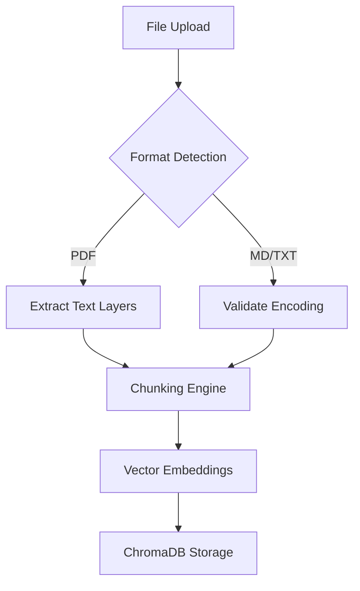

# Document Support
```markdown
# Key Features

## Document Support

The document memory system enables agents to process and retain information from various file formats. This section details supported formats and their handling mechanisms.

### Supported Formats

| Format    | Processing Method                     | Metadata Retention |
|-----------|---------------------------------------|--------------------|
| PDF       | Text extraction via PyPDF2            | File name, page #s |
| Markdown  | Semantic parsing with stripped markup | Headers, links     |
| Text      | Direct UTF-8 encoding                 | Line numbers       |

### Processing Workflow



### CLI Usage Example
```bash
# Upload document with automatic chunking
goat memory upload --agent research_bot --category technical papers/documentation.pdf
```

> [!NOTE]
> Current chunking uses fixed 512-token windows. For complex documents:
> - Pre-process markdown files with section headers
> - Use `.split.md` files for manual chunk control
> - Combine with `--chunk-size` flag for custom lengths

### Best Practices
1. **PDF Optimization**
   ```python
   # Recommended PyPDF2 settings
   pdf_reader = PdfReader(file, strict=False)  # Handle malformed PDFs
   ```
2. **Markdown Preservation**
   - Retain header hierarchies using `#` syntax
   - Preserve code blocks with triple backticks

3. **Text File Guidelines**
   - Use UTF-8 encoding for special characters
   - Separate sections with `---` dividers
   - Limit line length to 100 characters

See [Memory Management CLI](./memory-management-cli.md) for advanced operations.
```
