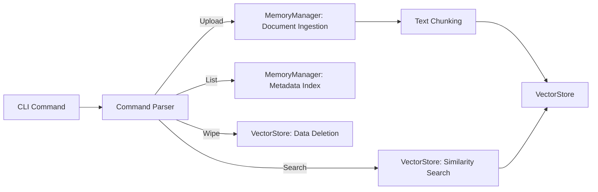

# Memory Management Commands
```markdown
# Key Features

## Memory Management Commands

The CLI provides granular control over document-based memory storage and retrieval. These commands enable interaction with the memory system through a structured interface, allowing agents to persist and query knowledge from documents.

### Command Overview
- **Supported Formats**: PDF, Markdown, and plain text files
- **Scope**: All operations are agent-specific and persisted across sessions
- **Chunking**: Automatic text splitting during ingestion (fixed-size chunks with overlap)

---

### 1. Upload Documents with Chunking
Ingests documents into memory storage after preprocessing.

**Syntax**:
```bash
agent memory upload <agent_id> <file_path> [--category=<name>]
```

**Example**:
```bash
agent memory upload project_alpha ./specs.pdf --category=technical_docs
```

> [!NOTE]
> Chunk size and overlap are configured in `MemoryManager` settings. Default: 512 tokens per chunk with 10% overlap.

---

### 2. Semantic Memory Search
Finds relevant memories using vector similarity.

**Syntax**:
```bash
agent memory search <agent_id> <query_text> [--limit=<results>] [--threshold=<score>]
```

**Example**:
```bash
agent memory search project_alpha "API authentication flow" --limit=5
```

**Output Columns**:
| Score | Category       | Content Excerpt          |
|-------|----------------|--------------------------|
| 0.78  | technical_docs | "OAuth2 implementation..." |

---

### 3. Memory Browsing
Lists stored memories with metadata.

**Syntax**:
```bash
agent memory list <agent_id> [--category=<filter>]
```

**Example Output**:
```
Memories for agent 'project_alpha' (Category: technical_docs):
- Document: specs.pdf [12 chunks]
- Document: api_guide.md [8 chunks]
```

---

### 4. Memory Removal
Permanently deletes stored memories.

**Syntax**:
```bash
agent memory wipe <agent_id> [--category=<specific_category>]
```

**Example**:
```bash
agent memory wipe project_alpha --category=obsolete_data
```

> [!WARNING]
> Wipe operations are irreversible. Use `--category` filter to prevent accidental full deletion.

---

## Command Workflow Visualization



---

## Best Practices
1. **Category Tagging**: Use explicit categories for better memory organization
2. **Query Specificity**: Frame search queries using domain-specific terminology
3. **Maintenance**: Regularly wipe obsolete memories to maintain search performance
4. **Batch Operations**: Process multiple documents through scripting wrappers
```
