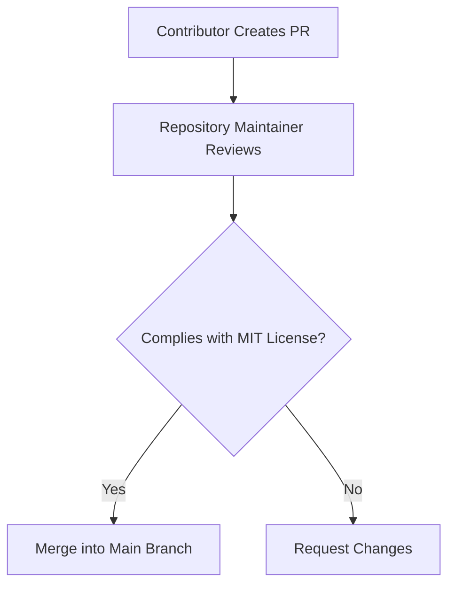

# Contributions under License
# Licensing

## Contributions under License

This section outlines how contributions to the repository are governed under the MIT License. Contributors must adhere to the terms of the license when submitting code, documentation, or other materials.

---

### Contribution Requirements
1. **License Compliance**: All contributions (code, documentation, or assets) are subject to the MIT License terms.
2. **Copyright Retention**: Contributors retain copyright ownership of their work but grant the repository and its users rights under the MIT License.
3. **Notice Inclusion**: Contributions must include the original copyright notice and license text in relevant files.

---

### Example: Code Contribution Header
```python
# Copyright (c) 2024 Ayoub Eddakhly
# MIT License
# 
# Permission is hereby granted... [truncated for brevity]

def example_function():
    """Sample code under MIT License."""
    return "Contribution example"
```

---

### Contribution Workflow


- **Diagram Explanation**:  
  Contributions are reviewed for compliance with the license before merging. Non-compliant submissions require updates.

---

### Best Practices
- Include the MIT License header in all source files.
- Document third-party dependencies separately (see [Dependency Licensing](link-to-dependency-section)).
- Use `> [!NOTE]` blocks in Markdown files for license-related clarifications.

> [!NOTE]  
> By submitting a pull request, contributors implicitly agree to license their work under the MIT License. This applies to all contribution types, including documentation fixes (e.g., grammar improvements in PR #106).

---

### Summary
- Contributions are irrevocably licensed under MIT terms.
- Maintainers enforce license compliance during code review.
- Always verify that new files include the required copyright and license notices.
