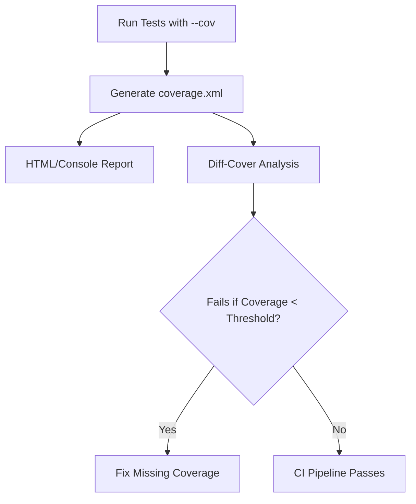

# Code Coverage
```markdown
# Testing

## Code Coverage

This section explains how code coverage is measured and enforced in the repository to ensure comprehensive testing of all components.

### Overview
Code coverage analysis helps identify untested parts of the codebase. The repository uses the following tools:
- **coverage**: Collects coverage data during test execution.
- **pytest-cov**: Integrates coverage measurement with pytest.
- **diff-cover**: Checks coverage gaps in modified code.
- **covdefaults**: Provides default configuration for coverage reports.

### Configuration
Add these lines to `pyproject.toml` to configure coverage:
```toml
[tool.coverage.run]
source = ["src"]
branch = true

[tool.coverage.report]
show_missing = true
```

### Running Coverage Analysis
1. Execute tests with coverage:
   ```bash
   pytest --cov=src --cov-report=term-missing tests/
   ```
2. Generate HTML report:
   ```bash
   coverage html
   ```
3. Check coverage for changed files (requires `diff-cover`):
   ```bash
   diff-cover coverage.xml --compare-branch=main
   ```

### Workflow Diagram


### Best Practices
- Enforce **100% coverage on new code** via CI checks.
- Use `covdefaults` to standardize report formats across environments.
- Review `diff-cover` results during code review to catch regressions.

> [!NOTE]
> The `covdefaults` package pre-configures coverage thresholds and output formats, reducing boilerplate in CI configurations.
```
