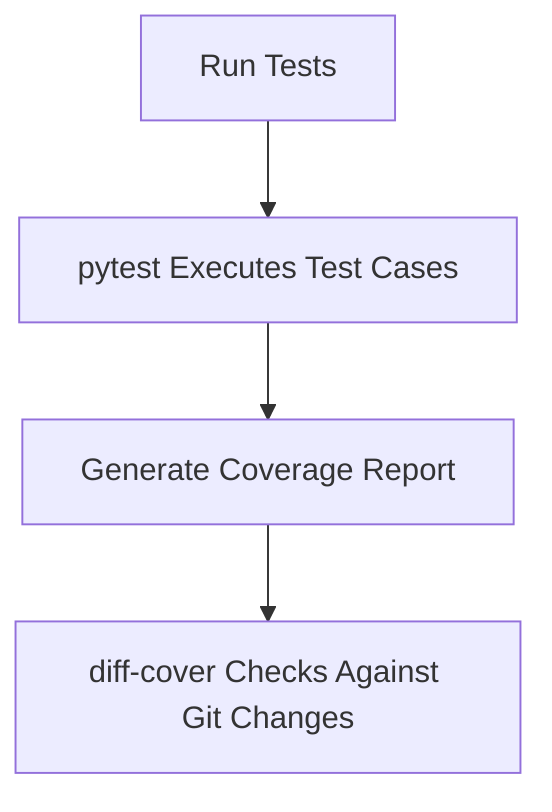

# Running Tests
```markdown
# Testing

## Running Tests

This section explains how to execute the test suite for the repository to ensure code reliability and functionality.

---

### Prerequisites
Install the required testing dependencies using:
```bash
pip install -e '.[testing]'
```
This installs:
- **Testing Frameworks**: `pytest`, `pytest-asyncio`, `pytest-cov`, `pytest-mock`, `pytest-timeout`
- **Coverage Tools**: `coverage`, `covdefaults`, `diff-cover`
- **Type Checking**: `mypy`
- **Property-Based Testing**: `hypothesis`

---

### Running the Test Suite
Execute all tests with:
```bash
pytest tests/ -v --cov=src/ --cov-report=term-missing
```
- `-v`: Verbose output.
- `--cov`: Generates code coverage reports.
- `--cov-report=term-missing`: Highlights untested lines.

For parallel test execution (using `pytest-xdist`):
```bash
pytest tests/ -n auto
```

---

### Key Workflows
#### Test Execution Flow


#### Tools in Action
1. **`pytest`**: Discovers and runs tests in the `tests/` directory.
2. **`pytest-asyncio`**: Handles asynchronous test cases.
3. **`pytest-cov`**: Measures code coverage.
4. **`diff-cover`**: Compares coverage gaps with recent code changes.

---

### Additional Commands
- **Run Specific Tests**:
  ```bash
  pytest tests/module_name/test_file.py::TestClassName::test_method
  ```
- **Type Checking**:
  ```bash
  mypy src/
  ```
- **Generate Coverage HTML Report**:
  ```bash
  coverage html && open htmlcov/index.html
  ```

---

### Best Practices
- Run tests locally before pushing changes.
- Use `pytest-timeout` to detect hanging tests.
- Address all `mypy` type errors and coverage gaps flagged by `diff-cover`.

> [!NOTE]
> For CI/CD integration, configure `diff-cover` to enforce coverage thresholds on pull requests.
```
