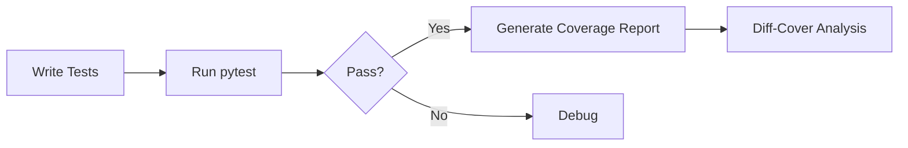

# Testing Frameworks
# Testing

## Testing Frameworks

This section outlines the testing frameworks and tools used in the repository to ensure code reliability, coverage, and compatibility.

---

### Core Testing Framework

The repository leverages **pytest** as the primary testing framework. Key features include:
- **Asynchronous Support**: Enabled via `pytest-asyncio` for testing async workflows.
- **Mocking Utilities**: `pytest-mock` simplifies object mocking.
- **Timeout Enforcement**: `pytest-timeout` prevents tests from hanging indefinitely.
- **Code Coverage**: `pytest-cov` integrates with `coverage` to measure test coverage.

```python
# Example test case
def test_example():
    result = 2 + 2
    assert result == 4, "Basic arithmetic validation"
```

---

### Key Plugins and Tools

| Tool                | Purpose                                                                 |
|---------------------|-------------------------------------------------------------------------|
| `coverage`          | Tracks code coverage metrics.                                          |
| `covdefaults`       | Preconfigures coverage settings for consistency.                       |
| `diff-cover`        | Compares coverage against Git changes.                                 |
| `virtualenv`        | Isolates test environments to avoid dependency conflicts.              |

> [!NOTE]
> `pluggy` (v1.5.0) underpins pytest's plugin architecture but requires no direct configuration.

---

### Example Workflow



1. Execute tests with coverage:
   ```bash
   pytest --cov=my_package tests/
   ```
2. Generate coverage report:
   ```bash
   coverage html
   ```
3. Analyze coverage gaps in modified code:
   ```bash
   diff-cover coverage.xml --compare-branch=main
   ```

---

### Best Practices
- Use `virtualenv` to isolate test environments.
- Annotate async tests with `@pytest.mark.asyncio`.
- Run `diff-cover` in CI pipelines to enforce coverage standards.
