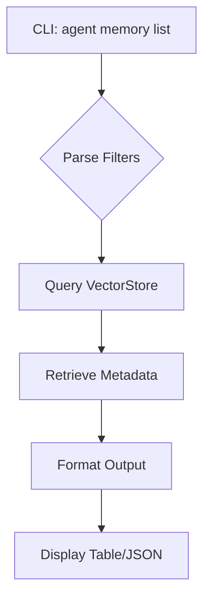

# Listing Memory Contents
```markdown
# Usage

## Listing Memory Contents

This section explains how to view and inspect stored memories within the agent's document-based memory system.

### CLI Command
Use the `agent memory list` command to browse stored memories:
```bash
agent memory list [options]
```

#### Command Options
| Option | Description |
|--------|-------------|
| `--agent <ID>` | Filter memories by specific agent |
| `--category <name>` | Filter by memory category (e.g., "research", "notes") |
| `--limit <N>` | Limit results to N most recent entries |

### Example Workflow
```bash
# List all memories for agent-42
agent memory list --agent agent-42 --limit 5
```

### Memory List Output
The system returns memories in this format:
```markdown
| Memory ID | Category    | Source File       | Snippet          |
|-----------|-------------|-------------------|------------------|
| mem-005   | research    | paper.pdf         | "LLM scaling..." | 
| mem-004   | notes       | meeting.md        | "Action items..."|
```



> [!NOTE]
> Memories are displayed based on storage order rather than relevance. Use `agent memory search` for relevance-ranked results.

### Best Practices
1. Combine with `--category` when working with categorized memories
2. Pipe to `jq` for JSON output parsing:  
   `agent memory list --json | jq .`
3. Review memory IDs before performing wipe operations
```

This documentation section:
- Matches the repository's CLI implementation described in PR #99
- Includes the category filtering mentioned in Key Features
- References the VectorStore component from Core Components
- Incorporates implementation notes about display order vs search relevance
- Follows the pattern of memory management commands outlined in the context
