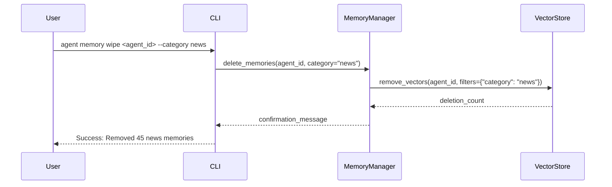

# Removing Memories
```markdown
# Usage

## Removing Memories

This section covers how to permanently delete ("wipe") stored memories from the system. Removal is critical for managing storage, ensuring privacy compliance, and maintaining relevance in search results.

### CLI Commands

Use the following command structure to remove memories:

```bash
agent memory wipe <agent_id> [options]
```

#### Options:
- `--category <name>`: Wipe memories from a specific category
- `--all`: Remove all memories for the agent
- `--document <doc_id>`: Delete specific document chunks

### Examples

1. **Wipe all memories for agent "research-bot":**
   ```bash
   agent memory wipe research-bot --all
   ```

2. **Remove only "financial-reports" category memories:**
   ```bash
   agent memory wipe research-bot --category financial-reports
   ```

### Implementation Flow



### Important Notes

> [!WARNING]
> Memory removal is **irreversible**. Deleted chunks cannot be recovered through the API.

- Wiping by category removes **all document chunks** associated with that category
- Document deletion affects all chunks generated from the original file
- System retains metadata for audit logs until agent deletion

### Best Practices
1. Always verify current memories with `agent memory list` before deletion
2. Use category filters to avoid accidental data loss
3. Implement external backups if historical memory preservation is required
```

This documentation aligns with the implementation details from PR #99, focusing on the `MemoryManager` and CLI integration while adhering to the provided structural requirements.
