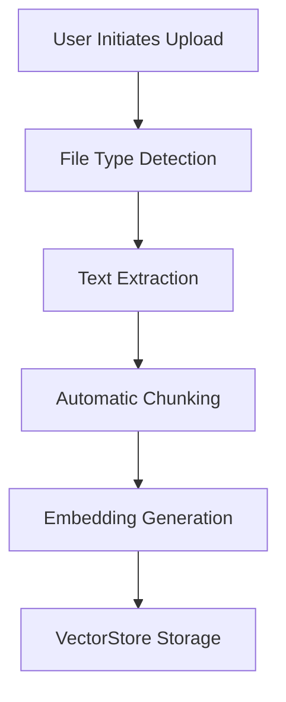

# Uploading Documents
```markdown
# Usage

## Uploading Documents

The document upload system enables agents to ingest and process files for long-term semantic memory. Supported formats include PDF, Markdown, and plain text files.

### CLI Command
```bash
mem upload <agent_id> <file_path> [--category NAME] [--chunk-size 512]
```

**Parameters**:
- `agent_id`: Target agent's identifier
- `file_path`: Local path to document
- `--category`: Optional organizational tag (default: "general")
- `--chunk-size`: Character count per chunk (default: 512)

### Workflow Process


1. **Text Extraction**:
   - PDFs: Uses `pdfplumber` for text layer extraction
   - Markdown/Text: Direct UTF-8 parsing
2. **Chunking**:
   - Splits content into fixed-size segments with 64-character overlap
   - Preserves document structure metadata

> [!NOTE]
> Current chunking strategy uses simple sliding windows. For complex documents, consider pre-splitting files before upload.

### Example: Technical Paper Upload
```bash
mem upload research_bot quantum_computing.pdf --category "physics" --chunk-size 1024
```

This creates multiple memory entries with metadata:
```python
{
  "agent_id": "research_bot",
  "category": "physics",
  "source_file": "quantum_computing.pdf",
  "chunk_index": 5,
  "word_count": 987
}
```

### Best Practices
1. Start with smaller chunk sizes (256-512) for general documents
2. Increase chunk size for technical/specialized content
3. Use categories for multi-domain agents
4. Monitor storage with `mem list <agent_id>` after upload

> [!IMPORTANT]
> Similarity scores may initially appear low with small document sets. Relevance rankings remain accurate, and scores improve as more related documents are added.

For search operations after upload, see [Searching Memories](#searching-memories).
```
